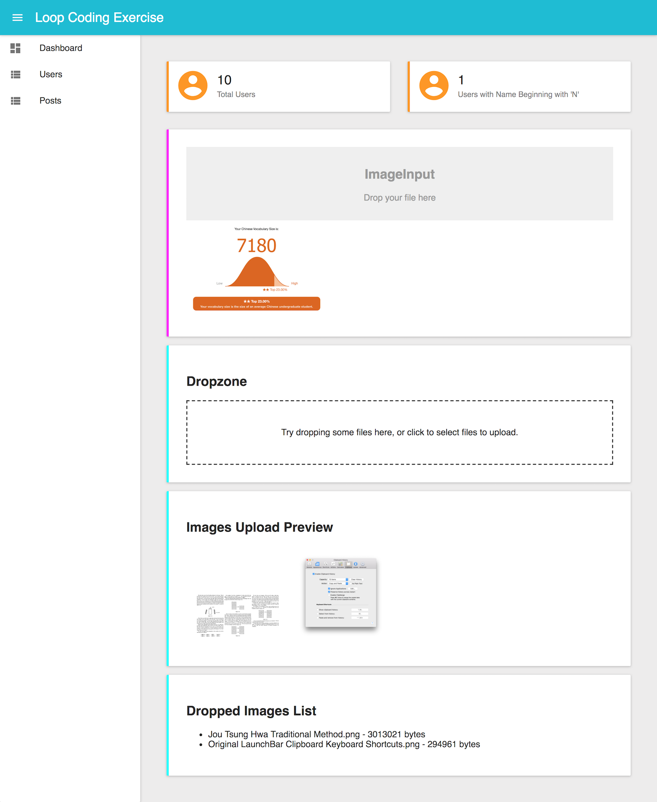

# Loop Coding Exercise

This was the coding exercise I went through during the job interview at [Loop](https://loop.space/). I have partially figured out the image upload dropzone which I did not touch upon during the coding exercise.

## Live Deployment

<https://loop-coding-exercise-foihoecmws.now.sh>

## Tasks

Using [Admin-on-REST](https://marmelab.com/admin-on-rest//index.html), [React](https://reactjs.org/), [Material UI](http://www.material-ui.com/) and ES6:

- Connect the React client to REST API endpoints through a REST client
- Create a page component listing all the users.
- Create a page component listing all the posts.
  - Create a column showing the author of each post.
  - Add "Create" and "Edit" functions.
- Create a simple dashboard
  - Call the REST client directly without relying on the abstractions provided Admin-on-REST to perform the tasks below.
  - Create a simple dashboard component with an appropriate icon showing the
    - Total number of users.
    - Number of users whose names begin with 'n', uppercase and lowercase.
- Create a dropzone to drag and drop pictures for uploading and render a preview of each picture.

# Acknowledgements

Many thanks to:

- [Chi Tran](https://www.linkedin.com/in/chitran1/) for spending many precious hours coaching me, and
- [Jared Neo](https://www.linkedin.com/in/jared-neo-aik-yong-40779332/) for giving me the chance to interview at Loop
